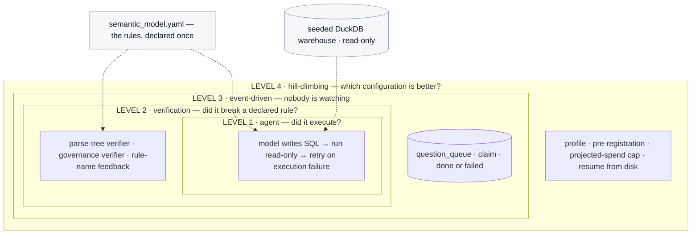
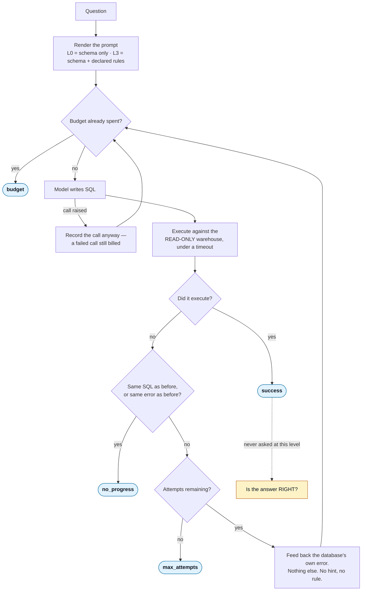
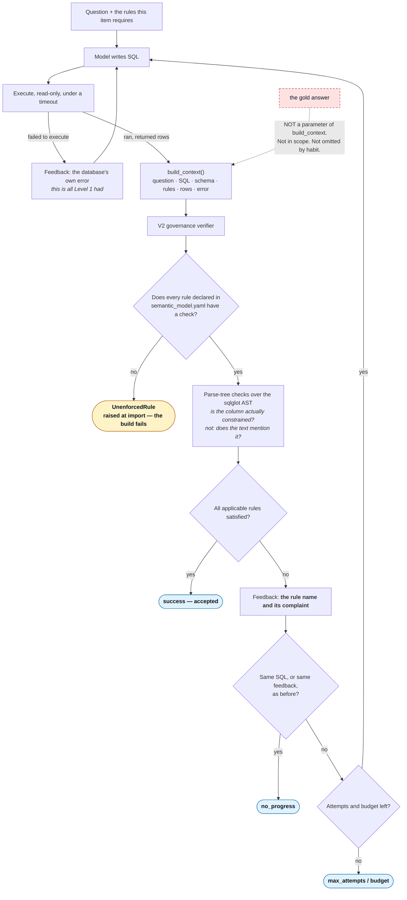
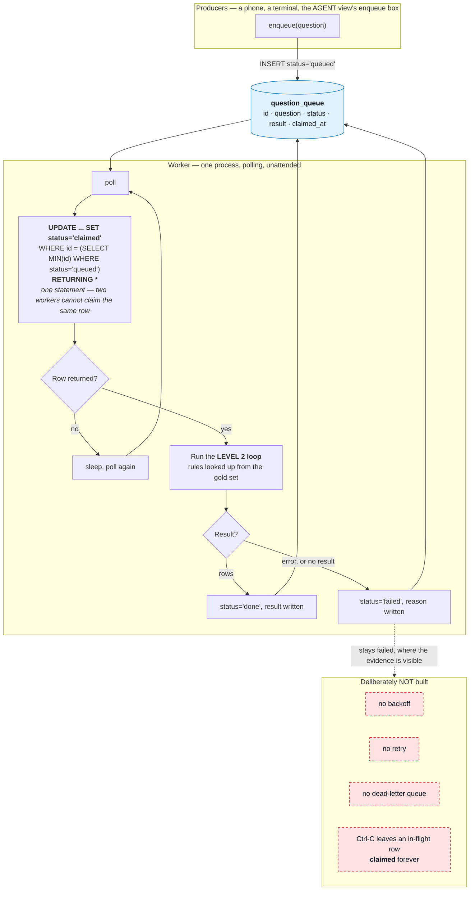
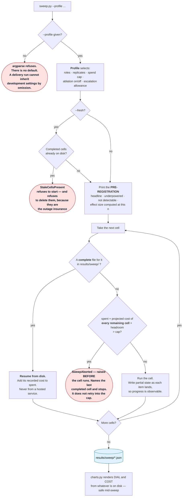
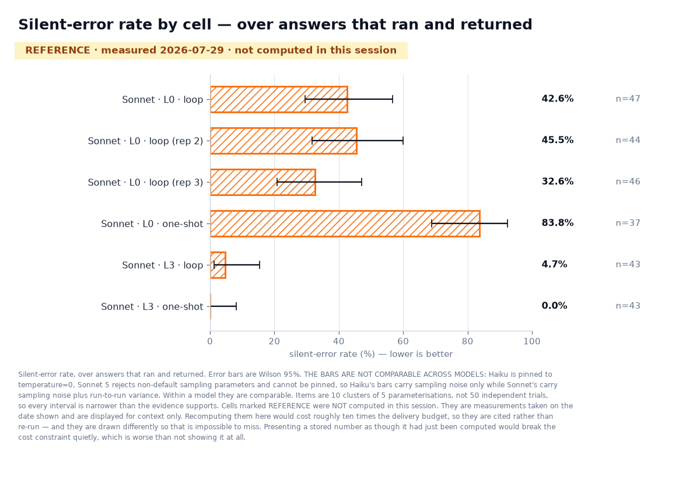
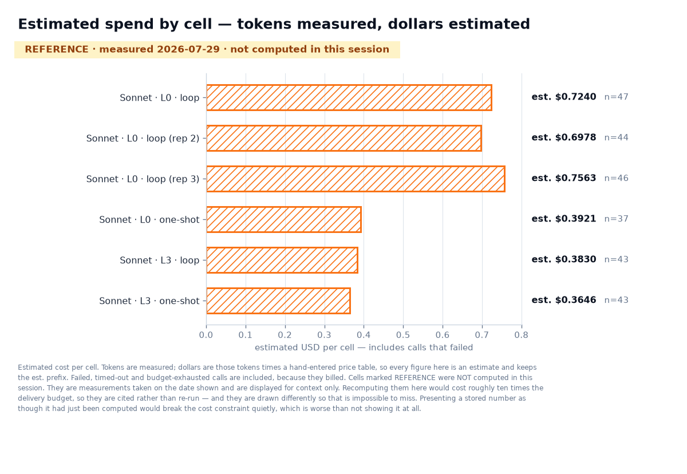
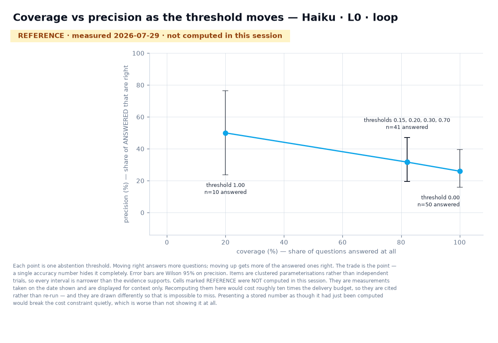

# Loop Engineering

A workshop application about the gap between a rule you declared and a rule something
actually enforces.

It runs a text-to-SQL agent against a seeded warehouse whose business rules live in one
config file, and builds four nested loops around that agent: retrying on failure,
verifying what the retry cannot see, running with nobody watching, and measuring which
configuration is better. Every figure it renders carries the time it was computed and
the number of observations behind it, because a number on a projector with neither is
indistinguishable from a number somebody typed.

**The application is the argument.** There is no slide claiming that measurement matters
without something on screen doing the measuring.



---

## 1. Contents

| | |
|---|---|
| [2 · The session](#2--the-session) | duration, audience, format |
| [3 · The problem](#3--the-problem) | a clean, plausible, wrong number |
| [4 · Why this is needed](#4--why-this-is-needed) | declared versus enforced |
| [5 · What loop engineering is](#5--what-loop-engineering-is) | the four-loop framing and where it comes from |
| [6 · Architecture](#6--architecture) | the nesting, and each loop's control flow |
| [7 · Technologies](#7--technologies) | what each dependency does here |
| [8 · Repository structure](#8--repository-structure) | |
| [9 · Installation](#9--installation) | |
| [10 · Environment setup](#10--environment-setup) | every variable, and why tracing defaults off |
| [11 · Running each demo](#11--running-each-demo) | **step by step — start here** |
| [12 · Expected outputs](#12--expected-outputs) | the result images |
| [13 · Profiles and cost](#13--profiles-and-cost) | |
| [14 · Testing](#14--testing) | |
| [15 · Design decisions](#15--design-decisions) | each with what was given up |
| [16 · Limitations](#16--limitations) | |
| [17 · Future improvements](#17--future-improvements) | |
| [18 · Troubleshooting](#18--troubleshooting) | |
| [19 · FAQ](#19--faq) | |
| [20 · Attribution and licence](#20--attribution-and-licence) | |

---

## 2 · The session

**Duration:** three to three and a half hours.

**Audience:** engineers and data people who are already building with agents, or about
to. No prior agent framework experience is assumed; SQL is assumed.

**Format: opt-in floater.** People arrive mid-session and leave mid-session, and the
stage that runs is whichever one the room has arrived for. That is a constraint on the
code, not just on the schedule:

> **Every stage cold-starts.** No demo may depend on another having run. Every entry
> point generates or loads what it needs — the warehouse is created on first use, the
> gold set is rebuilt from its patterns, the queue table is created on connect. A test
> runs each entry point from an empty working directory, so *"it worked when I ran them
> in order"* cannot pass for working.

The stages map one-to-one onto the loop levels, and each stage's runbook lives beside
its code in [`demos/`](demos/). There is deliberately no separate runbook document: one
kept apart from its code drifts, and a runbook that lies at minute forty of a live
session is the thing this cannot afford.

---

## 3 · The problem

An agent writes a SQL query. The query parses. It runs. It returns a single, clean,
plausible number, formatted exactly like the right answer.

And it is wrong.

It is wrong because it counted orders that were soft-deleted, or summed euros and yen as
though they were the same unit, or double-counted revenue by aggregating order totals
after joining the line items. Every one of those produces a number that looks like every
other number.

**You cannot tell by looking.** That is the whole difficulty:

| | you can detect it without the answer | example |
|---|---|---|
| **visible failure** | **yes** | invalid SQL, a timeout, an empty result, three columns where one was asked for |
| **silent error** | **no** | it ran, returned one plausible number, and is wrong |

A retry loop catches the first column. Nothing about a retry loop touches the second,
because a retry loop only ever learns that something *crashed* — and a wrong answer does
not crash.

The uncomfortable part is that every mitigation people reach for first has the same
shape. A more capable model produces a more plausible wrong number. A larger context
window produces a more plausible wrong number. An LLM judge from the same model family
agrees with the wrong number.

---

## 4 · Why this is needed

Ask where the business rules live and you will be shown a config file, a semantic layer,
a dbt model, a wiki page. The rules are written down. Everyone can point at them.

Then ask: **what enforces them?**

Often the honest answer is *the prompt* — the rules are pasted into a system message and
the model is trusted to apply them. That is not enforcement. It is a request.

Sometimes the answer is *a check* — and the check is a regular expression looking for the
right words in the query text, which passes a query that mentions `deleted_at IS NULL`
inside a comment, inside a subquery that never filters, or negated.

Sometimes the rule is enforced only as a side effect of another rule's check, which is
indistinguishable — from the config's point of view — from not being enforced at all.

**A rule written in a config that nothing checks is not a rule.** It is a comment with
ambitions.

This project makes that gap concrete and then closes it, in one narrow place, with
machinery you can read in an afternoon:

- the rules are declared **once**, in `semantic_model.yaml`, and rendered into prompts
  from that one place, so a rule cannot exist in the prompt and not in the model
- a governance verifier reads its rule set **from the config** and **fails the build**
  when a declared rule has no check
- each rule has **two probes** — a query that breaks it and must be rejected, and one
  that is correct but unusual and must be accepted — because a verifier that rejects
  everything scores perfectly without the second
- and the project points the same lens at itself: three things in this build were
  declared and never enforced, and all three passed code review

---

## 5 · What loop engineering is

The framing is not ours. LangChain's [**The Art of Loop
Engineering**](https://www.langchain.com/blog/the-art-of-loop-engineering) describes four
loops that stack on one another — the agent loop, a verification loop, an event-driven
loop, and a hill-climbing loop — and credits swyx's [**Loopcraft: the art of stacking
loops**](https://www.latent.space/p/ainews-loopcraft-the-art-of-stacking) for the idea
that loops can be stacked and extended to build more effective agents.

We take the taxonomy and disagree with nothing in it. What this repository adds is the
part a blog post cannot: **a running system where each level's claim is checked**, and
where the levels are built so you can see exactly what each one buys and exactly what it
still cannot see.

> All diagrams here are drawn from our own control flow. No images are reproduced from
> either source.

The shift the term names is this. **Prompt engineering** asks what to put in the context
window. **Loop engineering** asks what happens after the model answers: what checks it,
what feeds back, what stops, and how you know any of it is working. The interesting part
of a loop is never the repetition — it is always the termination condition, and whether
anything counts how often each one fires.

---

## 6 · Architecture

The loops **wrap one another rather than sitting side by side**. Level 2 calls Level 1's
generator and adds a verifier around it. Level 3 runs the Level 2 loop against a claimed
queue row. Level 4 sweeps Levels 1 and 2 across models and prompt completeness.

That nesting is the architectural claim, and it is why **the implementation lives in
`src/loopeng/` while `demos/` holds thin entry points**. Four folders each owning a copy
of the loop would be four places for it to drift, and every number the room sees has to
come out of one system or the comparisons between levels mean nothing. A test caps demo
files at a hundred lines and fails the build when logic leaks.

The system-overview diagram is at the top of this file. Each level's control flow
follows.

> Each diagram below is the same source as the one in that stage's runbook, and a test
> asserts they are byte-identical. A diagram duplicated by hand is a diagram that drifts.

### Level 1 — the agent loop

A model writes SQL, the query runs against a read-only connection, and a failure comes
back as the database's own error. It retries on execution failure and nothing else.

**It catches syntactic failure. It cannot catch a query that parses, runs, returns a
clean number and is wrong.** Four termination conditions are recorded by name so their
distribution across a run can be reported — a policy branch nobody counts is a branch
nobody knows fires.



Runbook: [`demos/01_agent_loop/README.md`](demos/01_agent_loop/README.md)

### Level 2 — the verification loop

Rule checks read the query's **parse tree** and reject one that ran but broke a declared
business rule, handing back **the rule name rather than the answer**.

The verifier never receives the gold answer, and that is structural: the context type has
no field for it and the function that builds one takes no such argument. A second,
deliberately weaker verifier checks the same rules with regular expressions, to
demonstrate what happens when an instrument gets weaker and every dashboard number
improves.



Runbook: [`demos/02_verification_loop/README.md`](demos/02_verification_loop/README.md)

### Level 3 — the event-driven loop

A queue table, and a worker that claims a row and runs the Level 2 loop against it with
no human in the path.

Deliberately minimal: **no backoff, no dead-letter queue, no retries.** A failed row
stays failed where the evidence is visible. Those omissions are the list of things you
would have to build before this went near production, and naming them is more useful
than half-implementing them.



Runbook: [`demos/03_event_driven_loop/README.md`](demos/03_event_driven_loop/README.md)

### Level 4 — the hill-climbing loop

A sweep across model and prompt completeness, with its hypothesis printed before the
first cell runs. It resumes from local results rather than from any hosted service,
aborts on **projected** rather than actual spend, and renders cells that are still
running as in progress with their current interval — never as blank or zero.



Runbook: [`demos/04_hill_climbing_loop/README.md`](demos/04_hill_climbing_loop/README.md)

---

## 7 · Technologies

| technology | what it does **here** |
|---|---|
| **Python 3.12** | Pinned by `.python-version` and `requires-python`. `StrEnum`, `Self` and PEP 604 unions are used throughout. |
| **uv** | Dependency resolution, the lock file, and the virtualenv. Every command in this README runs through `uv run`, which resolves to the project's own interpreter rather than whatever is first on `PATH`. |
| **DuckDB** | The seeded warehouse, and separately the question queue. Opened **read-only** for the agent, enforced by the database rather than by convention. Chosen over a hosted database so the workshop has no network dependency it does not need. |
| **Gradio** | The five views. Chosen because a view is a function plus a layout, and the alternative was a frontend build step at a venue. |
| **sqlglot** | Parses model-written SQL into an AST so rule checks can ask whether a column is actually constrained, rather than whether the query text mentions it. Also detects whether the outer query carries an `ORDER BY`, which decides whether result comparison is order-sensitive. |
| **matplotlib** | **Dev dependency only.** Renders the deterministic README images in `assets/` from the committed reference measurements. It is never imported by anything the session or the Space runs. |
| **LangSmith** | Traces and the gold dataset upload. **Advisory only** — `results/*.json` is the system of record, and a test runs a cell with the client stubbed to raise and asserts the results file is still complete and correct. |
| **pydantic-settings** | Loads settings once, frozen, with `SecretStr` so a key cannot be printed by accident. A missing credential raises an error naming the exact variable and the exact fix. |
| **structlog** | Console-rendered logs, not JSON: these are read live, on a projector, by a room of people, not shipped to an aggregator. |
| **ruff** | Lint and import sorting, run in CI on every push. |
| **pytest** | The offline suite, plus a `live` marker that is deselected by default so the default run needs no key and no network. |
| **Anthropic API** | The only model provider. Two roles — a cheap worker and a frontier model — with per-model request kwargs, because the two do not accept the same request. |

---

## 8 · Repository structure

```
src/loopeng/
  settings.py        frozen settings, fail fast, secrets never rendered
  registry.py        role to model, with the request kwargs each model accepts
  metric.py          Metric and MetricStore; no value without its n
  pricing.py         the price table, dated, per model, per token class
  usage.py           token accounting for every call including the failed ones
  paired.py          McNemar for paired comparisons
  prompts.py         the L0 and L3 prompts, rules rendered from config
  contracts.py       the verifier's view of an attempt — no field for the answer
  api_probes.py      LIVE probes of the API: rate-limit ceilings and
                     prompt cacheability. Renamed from probes.py, which
                     collided by name with verify/probes.py — a different
                     thing entirely (offline rule-surface probes)
  gate0.py           assembles the foundation evidence report
  langsmith_ds.py    gold to LangSmith dataset, advisory and failure-tolerant
  env_guard.py       refuses to run from a cloud-synced path that breaks imports
  warehouse/         seeded generator, semantic model, read-only connection factory
  gold/              patterns, build, comparison
  agent/             level 1 loop, classification, the trap
  verify/            level 2 loop, verifiers, governance, the OFFLINE
                     rule-surface probes, the swap
  queue/             level 3 queue and worker
  sweep/             level 4 runner, profiles, charts, reference cells
  triage/            abstention, escalation, failure triage
  views/             the five Gradio views, and the frozen exhibit
demos/               thin entry points and the runbooks, one folder per loop level
tools/               the numeric-literal rule, the README chart renderer, the HF sync
deploy/hf/           the Hugging Face Space entry point
assets/              generated README images — written only by tools/
results/             measurements; see below for what is committed
tests/               the offline suite, plus tests/live/ behind the live marker
```

**What is committed under `results/`, and why the split matters:**

| path | committed | why |
|---|---|---|
| `results/reference/` | **yes** | the frozen measurements the delivery charts cite: `measurements.json` (the Sonnet cells, and what `assets/*.png` is drawn from) and `worker_baseline.json` (the Haiku half of the same run, so a cloner's own cells have a stored counterpart to be differenced against) |
| `results/prefix_v1/` | **yes** | the pre-fix measurements — the triage artifact and what the defect cost |
| `results/gate0.json` | **yes** | foundation evidence, cited throughout |
| `results/sweep/`, `results/ablation/` | **no** | live cell output. A committed cell would arrive on every clone and make the *first* live sweep on a fresh machine resume-and-complete instantly, rendering finished numbers to a room told nothing is precomputed. |

**A fresh clone renders *not yet measured*, and what enforces that changed.** The
protection above is about *resuming*: an uncommitted `results/sweep/` means the first
live sweep has nothing to resume from. `results/reference/worker_baseline.json` sits
outside `results/sweep/`, so it does not make the sweep resume — but it is a full set of
stored cells, and a renderer asked for them will draw them. **The same end state, reached
a different way**, which is what a protection written against one mechanism cannot see.

So the property is now enforced where it is claimed rather than inferred from a
`.gitignore`. `--reference` defaults to `auto`: the stored baseline is shown once this
run has a cell of its own to compare it against, and hidden until then. A test runs the
chart entry point against an empty directory and asserts the output carries no
`REFERENCE` row and no p-value — the path a human takes, not a renderer handed empty
cells. `PRE-DELIVERY-CHECKLIST.md` step 0b is the same check in a session, since a
checklist line is not enforcement and this needs both.

---

## 9 · Installation

**Prerequisites:** Python 3.12 and [uv](https://docs.astral.sh/uv/). Nothing else — no
Docker, no database server, no cloud account.

```bash
git clone https://github.com/ANI-IN/loop-engineering-workshop.git
cd loop-engineering-workshop
uv sync
uv run pytest -q
```

The test suite is **offline by default**. It needs no API key, makes no network call, and
costs nothing, so a green suite on a fresh clone tells you the checkout is sound before
you have spent anything.

**Put the checkout somewhere your cloud storage does not sync.** iCloud Drive evicts
files it thinks are cold, and an evicted `.pth` file breaks the editable install in a way
that looks like a mysterious import error. A guard catches this at import and says what
happened, but moving the directory is the actual fix.

---

## 10 · Environment setup

Copy `.env.example` to `.env` and fill in the keys. The example file holds names only and
is committed; `.env` holds values and is ignored.

| variable | required by | notes |
|---|---|---|
| `ANTHROPIC_API_KEY` | any live model call | Not needed for the offline suite, the exhibit, or the rule-surface probes. |
| `LANGSMITH_API_KEY` | the dataset upload and trace links | Everything works without it; traces degrade, measurements do not. |
| `LANGSMITH_PROJECT` | the project experiments are filed under | Defaults to the workshop project rather than the SDK's shared `default` bucket. |
| `LANGSMITH_TRACING` | — | Defaults to **false** and must stay false for the offline suite. See below. |
| `LOOPENG_LIVE` | a *hosted* instance that may call models | Off unless explicitly set. A key alone does not enable it. |
| `LOOPENG_LIVE_CEILING_USD` | a hosted live instance | Required when `LOOPENG_LIVE` is set. Live with no ceiling is not a configuration this accepts; it refuses rather than defaulting to a number nobody chose. |
| `LOOPENG_LIVE_MAX_CALLS` | a hosted live instance | Optional call ceiling alongside the spend ceiling. |

Settings are loaded once, frozen, and fail fast. A missing key raises an error naming the
exact variable and the exact fix, rather than failing forty minutes into a session.

**Why tracing defaults off.** The LangSmith SDK enables itself from the environment, so a
machine with the tracing flag exported would have ordinary test runs attempting
background network sends — quietly breaking the zero-network property the offline suite
is built on. A test asserts tracing is off outside the live marker, and the suite forces
every known spelling of the variable to false.

---

## 11 · Running each demo

### 11.0 · Run it on your own key

Everything below §11.0 is written for the author delivering a workshop. This part is for
someone who just cloned.

```bash
cp .env.example .env          # add ANTHROPIC_API_KEY only; LangSmith is optional
uv sync && uv run pytest -q   # offline, free, proves the checkout

uv run python demos/00_preflight/check.py                      # a fraction of a cent
uv run python demos/04_hill_climbing_loop/sweep.py --profile smoke --foreground
uv run python demos/04_hill_climbing_loop/charts.py --reference=compare
```

The preflight is the cheap one to run first. Two calls, one per model, **with the request
kwargs the registry declares** — which is the point, because `temperature=0` is legal on
Haiku and a `400` on Sonnet 5, so a simplified probe could pass on an account where the
sweep fails. It also builds the warehouse and the gold set and runs the rule-surface
probes, and those three are offline, so a bad key still tells you the rest of the checkout
is sound.

What each profile projects, from the repo's own `project_remaining`:

| profile | cells | items | projected |
|---|---|---|---|
| `smoke` | 2 | 8 | est. $0.03 |
| `delivery` | 4 | 50 | est. $0.43 |
| `development` | 12 | 50 | est. $5.59 |

`smoke` measures nothing worth quoting — eight items cannot separate anything, and it does
not pretend to. It proves the whole pipeline on your key: real calls, cells on disk, four
charts rendered, and the difference against the committed baseline computed with exact
McNemar. `--reference=compare` is what puts your run and the stored one on the same chart;
`--reference=fill` shows a stored cell only where you have no live one, and `hide` drops
them entirely.

**No chart in this repo can be produced without live Claude API calls**, except the ones
explicitly badged REFERENCE and the ones served by `--view exhibit`. That has always been
true and enforced — there is a test asserting a fresh clone renders "not yet measured" —
and it is worth saying to your face: if a figure appears without you having spent anything,
it is a stored measurement and it is labelled as one, in the row and inside the image.

If your key is wrong you will find out in **one** call, not three. The loops stop on a
`401`, `403` or `400` rather than retrying, and the message names the variable and the fix.
Nothing anywhere will tell you the database said it.

---

**This is the section to actually use.** Each stage below is self-contained: it
cold-starts, it needs no earlier stage, and it says what to look at rather than only what
to type. Full detail — including what to say when the expected shape does not appear —
is in each stage's runbook.

Everything runs through `uv run`. Use `python -u` for anything that serves a browser:
without it Python block-buffers stdout when you redirect to a file and the URL never
appears even though the server is fine.

### Stage 0 — ground truth

```bash
# the rules, declared once
cat src/loopeng/warehouse/semantic_model.yaml

# the rule surface: two probes per rule, offline and free
uv run python -c "
from loopeng.verify.probes import run_probes
import json; print(json.dumps(run_probes(), indent=2))"
```

**On screen:** the seven rules as configuration, then per rule whether the verifier
caught a violating query *and* accepted a correct-but-unusual one.

**What to observe:** both columns. A verifier that rejects everything scores perfectly on
the first alone.

**The question to sit with:** *how would you know your own rule checks are not just
rejecting everything?*

### Stage 1 — the agent loop, and the trap

```bash
# one question, live, with the attempt timeline and cost ticking
uv run python demos/01_agent_loop/run.py \
  --question "What was gross revenue in March 2025 from our euro and yen orders, in US dollars?"

# the trap: every gold question at both spec levels, then the reveal
uv run python -u demos/01_agent_loop/trap.py
```

**On screen:** for `run.py`, one block per attempt — the SQL, and either the rows or the
database error. For `trap.py`, a grid filling in, with **every landed cell rendering
identically** until you press reveal.

**What to observe:** while the trap fills, the two columns look the same. That is
deliberate — a cell reading "failed" would hand the room a free answer key for that row.
After the reveal, the split into correct, **silently wrong**, and visible failure.

**The question to sit with:** *of the cells that are wrong, how many could you have
spotted without the answer key?*

→ [full runbook](demos/01_agent_loop/README.md)

### Stage 2 — verification

```bash
# one question through the verifiers, showing the attempt diffs
uv run python demos/02_verification_loop/run.py

# swap the parse-tree verifier for the regex one
uv run python demos/02_verification_loop/regex_swap.py

# the beat that matters most: a satisfied verifier and almost nothing right
uv run python demos/02_verification_loop/regex_swap.py --level L0

# the three ways a run ends without succeeding
uv run python demos/02_verification_loop/failure_paths.py
```

**On screen:** a query that **ran cleanly, returned rows, and was still sent back** with a
named rule. Then the swap's two arms side by side — acceptance rate, actual correctness,
rejections, cost, and probe surface.

**What to observe:** the acceptance rate rising while the probe surface degrades. Three of
those four numbers look like an improvement on a dashboard.

**The question to sit with:** *which of those numbers would have told you the instrument
got worse — and would it have been on your dashboard?*

→ [full runbook](demos/02_verification_loop/README.md)

### Stage 3 — event driven

**Two terminals.** Make both visible before you start.

```bash
# terminal 1 — the worker polls, claims, runs Level 2, writes back
uv run python demos/03_event_driven_loop/worker.py

# terminal 2 — submit a question
uv run python demos/03_event_driven_loop/enqueue.py \
  --question "What share of beauty orders ended up with a refund?"
```

The room can also submit from the enqueue box in the AGENT view.

**On screen:** terminal 2 prints the row id. Terminal 1, unprompted, prints `claimed`,
then the loop running, then `done` or `failed`.

**What to observe:** nobody typed anything into terminal 1.

**The question to sit with:** *the verifiers just decided, alone, whether that answer was
good enough to write back. Would you have shipped what they accepted?*

→ [full runbook](demos/03_event_driven_loop/README.md)

### Stage 4 — hill climbing

```bash
# start the sweep — detaches and hands the terminal straight back
uv run python demos/04_hill_climbing_loop/sweep.py --profile delivery --fresh

# render both charts from whatever exists so far; safe to run repeatedly mid-sweep
uv run python demos/04_hill_climbing_loop/charts.py --with-reference
```

**On screen:** the pre-registration, printed **before the first cell** — the headline
comparison, what the design is underpowered for, what it already knows it cannot detect,
and the detectable effect size at this `n`, computed rather than asserted.

**What to observe:** run `charts.py` twice a minute apart. The intervals narrow as more
items land. That narrowing is the session's argument about measurement happening live
rather than being asserted.

**The question to sit with:** *the pre-registration named an effect size this design can
detect. Is the gap you are looking at bigger than that?*

→ [full runbook](demos/04_hill_climbing_loop/README.md)

### The views

```bash
uv run python -u demos/views.py --view {agent,trap,verify,dial,oversight,exhibit}
```

Each launch prints a local URL, the LAN address a phone on the same wifi needs, and writes
a QR code — because nobody types a URL off a projector. Add `--share` for a public tunnel
when the venue wifi isolates clients. `--port` lets you run several at once, which is how
the workshop uses them: one tab per stage.

`--view exhibit` is the frozen, zero-model-call version. It is the one to open when you
want the application readable without any chance of spend.

**The event-driven loop is deliberately not a view.** The point of that stage is that
nobody is watching, and a browser tab implies a person supervising it.

---

## 12 · Expected outputs

Every image below is generated by `tools/render_readme_charts.py` from the committed
reference measurements, and re-running it produces byte-identical files. Nothing here is
hand-placed or screenshotted, and a test asserts that.

**Each image carries its measurement date and its `n` inside the image**, because a
README figure outlives every sentence next to it — it gets screenshotted, pasted into a
deck, and quoted back with the caption long gone. The prose in this README stays
number-free for the same reason: the numbers live where they cannot be separated from
their provenance.



*Example output from the development run of 2026-07-29. In the session this chart is
computed live and stamped with the time; here it renders stored reference cells, drawn
hatched and dated so a stored figure cannot pass for a fresh one.*

<!-- generated: tools/render_readme_charts.py -->

| cell | silent-error rate | est. cost |
|---|---|---|
| `frontier_L0_loop_r0` | 42.6% (n=47, ±14.2, measured 2026-07-29) | est. $0.7240 |
| `frontier_L0_loop_r1` | 45.5% (n=44, ±14.5, measured 2026-07-29) | est. $0.6978 |
| `frontier_L0_loop_r2` | 32.6% (n=46, ±14.4, measured 2026-07-29) | est. $0.7563 |
| `frontier_L0_one_shot_r0` | 83.8% (n=37, ±14.9, measured 2026-07-29) | est. $0.3921 |
| `frontier_L3_loop_r0` | 4.7% (n=43, ±10.8, measured 2026-07-29) | est. $0.3830 |
| `frontier_L3_one_shot_r0` | 0.0% (n=43, ±8.2, measured 2026-07-29) | est. $0.3646 |

These are the author's development-run measurements from **2026-07-29** on `claude-sonnet-5`. They are **REFERENCE — not computed on your machine.** To render the equivalent chart from your own key:

```bash
uv run python demos/04_hill_climbing_loop/charts.py --reference=compare
```



*Example output from the development run of 2026-07-29. Like the chart above it renders
stored reference cells, not a live computation — the session recomputes it and stamps it
with the time. Tokens are measured; dollars are those tokens times a hand-entered price
table, so every figure keeps its `est.` prefix — and calls that failed are included,
because they billed.*

<!-- generated: tools/render_readme_charts.py -->

| cell | est. cost | n |
|---|---|---|
| `frontier_L0_loop_r0` | est. $0.7240 | 47 |
| `frontier_L0_loop_r1` | est. $0.6978 | 44 |
| `frontier_L0_loop_r2` | est. $0.7563 | 46 |
| `frontier_L0_one_shot_r0` | est. $0.3921 | 37 |
| `frontier_L3_loop_r0` | est. $0.3830 | 43 |
| `frontier_L3_one_shot_r0` | est. $0.3646 | 43 |

These are the author's development-run measurements from **2026-07-29** on `claude-sonnet-5`. They are **REFERENCE — not computed on your machine.** To render the equivalent chart from your own key:

```bash
uv run python demos/04_hill_climbing_loop/charts.py --reference=compare
```



*Example output from the development run of 2026-07-29, rendered from a stored curve
rather than computed here. Raising the threshold answers fewer questions and gets more of
the answered ones right. The trade is the point — a single accuracy number hides it
completely.*

<!-- generated: tools/render_readme_charts.py -->

| threshold | answered | coverage | precision |
|---|---|---|---|
| 0.00 | 50 | 100.0% (n=50, ±7.1, measured 2026-07-29) | 26.0% (n=50, ±13.6, measured 2026-07-29) |
| 0.15 | 41 | 82.0% (n=50, ±12.8, measured 2026-07-29) | 31.7% (n=41, ±15.3, measured 2026-07-29) |
| 0.20 | 41 | 82.0% (n=50, ±12.8, measured 2026-07-29) | 31.7% (n=41, ±15.3, measured 2026-07-29) |
| 0.30 | 41 | 82.0% (n=50, ±12.8, measured 2026-07-29) | 31.7% (n=41, ±15.3, measured 2026-07-29) |
| 0.70 | 41 | 82.0% (n=50, ±12.8, measured 2026-07-29) | 31.7% (n=41, ±15.3, measured 2026-07-29) |
| 1.00 | 10 | 20.0% (n=50, ±13.0, measured 2026-07-29) | 50.0% (n=10, ±26.3, measured 2026-07-29) |

These are the author's development-run measurements from **2026-07-29** on `claude-haiku-4-5`. They are **REFERENCE — not computed on your machine.** To render the equivalent chart from your own key:

```bash
uv run python demos/04_hill_climbing_loop/charts.py --reference=compare
```

To regenerate them after a new reference measurement:

```bash
uv run python tools/render_readme_charts.py
```

`assets/manifest.json` travels with them, recording the hash of each image, the hash of
every source file it was rendered from, and the environment that rendered it. That last
part is a limit stated rather than hidden: **re-rendering is byte-identical within one
environment, but not across them** — matplotlib rasterises text through FreeType, so a
different platform draws the same figure to different pixels. Freshness is therefore
checked against the source hashes, which give the same answer anywhere, and byte-identity
is asserted only where it can honestly hold.

---

## 13 · Profiles and cost

`--profile` is **required** on the sweep and has no default, so a delivery run cannot
inherit development settings from a flag nobody typed.

| profile | what it runs | when |
|---|---|---|
| **delivery** | One model across four cells, with a small allowance for live escalation. Cost is a hard constraint rather than a target. | In front of a room, every time. |
| **development** | Both models with replicates and the ablation. | Once, to establish the findings. Not repeated per delivery. |
| **exhibit** | Nothing. No roles, no cells, a zero cap. | The public Space, where any attempt to run a cell must refuse immediately. |

Both spending profiles print their **projected** cost before the first cell and refuse to
start if the projection would breach the cap — a cap checked against money already spent
only discovers the breach afterwards. The delivery figure appears on screen in the
application, stamped with the time it was computed.

**Prompt caching saves nothing on any profile you are likely to run, and that is
measured.** A prefix has to clear the model's minimum cacheable length before
`cache_control` buys anything. Measured with `count_tokens` (`results/gate0.json`,
2026-07-29): Haiku's minimum is 4096 tokens against prefixes of 286 (L0) and 648 (L3);
Sonnet's is 1024 against 548 (L0) and 1037 (L3). **Exactly one combination clears it —
the frontier role at L3** — which is two of `development`'s twelve cells and none at all
of `delivery`, `smoke` or `exhibit`, since those run the worker role only.

So the note on the COST chart is a teaching beat rather than a saving you are getting:
the apparatus for this was all present — cache pricing, cache-token accounting, a probe
that measured which prefixes clear which minimum — and `cache_control` was set nowhere.
The instrument existed, the number was known, and the optimisation was never switched on.
It is switched on now, and on the profiles above it correctly does nothing. Where a
prefix cannot cache the request is left byte-identical to what the reference
measurements were taken with, so turning it on changed no committed number.

**Every dollar figure in this project is an estimate and the label never comes off.**
Tokens are measured — they come off the response, all four classes separately, including
calls that errored or timed out. Dollars are those tokens multiplied by a price table
typed in by hand on a particular day. Only a billing export would make cost a
measurement, and this project does not read one.

---

## 14 · Testing

```bash
uv run pytest -q                              # offline: no network, no keys, no cost
uv run pytest -m live -q                      # live: real API calls, real money
uv run ruff check .
uv run python tools/lint_no_numbers.py
uv run python tools/render_readme_charts.py   # regenerates assets/; must be a no-op
```

Live tests carry a marker and are deselected by default. The split is not a convention:
the offline suite is what runs in CI on every push, and it cannot be broken by a missing
secret because it never needed one. CI additionally asserts the live tests were
*deselected* rather than silently skipped.

**The numeric-literal rule** bans typed numbers in the eleven modules that render to a
projector, because a typed number is indistinguishable from a measured one once it is on
screen. Genuine layout geometry — figure coordinates, string truncation widths, a slider
step — is exempt via a trailing `# layout` marker on the line. There is a second, much
narrower exemption for measurement-shaped text that describes the *method* rather than a
result, held as an enumerated list of exact phrases. The rule prints **both** counts on
every run, so neither hatch can widen quietly, and a test fails the build on an allowlist
entry that exempts nothing.

That rule was itself broken **three times**, and all three failures are now
regression-tested.

It pointed at a path that no longer existed, so it scanned nothing and passed. And the
test written to prevent that planted its violation by *writing* the file, which created
the missing target — proving the walker worked while never checking the target was real.
A declared target that does not resolve is now a build failure.

**The third is the sharpest, because the rule was green while enforcing the opposite of
its own justification.** It inspected numeric literals only. A number inside a *string*
is a string constant, so it was skipped — and a string is the only form that reaches a
projector at all. A bare `PASS_RATE = 78` never reaches anyone; a rendered label does.
The single most quoted screen in the session carried two hardcoded statistical
conclusions with typed p-values, in a file the rule had always scanned, and the build was
green. The rule now inspects string constants and f-string literal parts for
measurement-shaped text, and the readings on that screen are derived from the cells on
disk. Deriving them changed what they say: the comparison is cross-model, and the
comparability guardrail that had lived only in prose now refuses to put a significance
claim across it.

Docstrings and comments are deliberately out of scope. Nothing here renders one — checked
rather than assumed — and they are where measured numbers get their provenance recorded.
Banning them would strip the rationale that makes this code reviewable in exchange for
catching nothing anyone can see.

**A citation printed as provenance must resolve.** The pre-registration named a
determinism-floor file that `.gitignore` dropped, so on every clone it cited a path that
did not exist. The file is committed, the figure is read out of it rather than restated
beside it, and a test asserts every repo path named in `sweep/orchestrator.py` and
`sweep/reference.py` exists on disk.

---

## 15 · Design decisions

Each of these was a real fork in the road. What was given up is stated, because a
decision recorded without its cost is advocacy.

**DuckDB over a hosted Postgres.**
*Reasoning:* the deployment target is a laptop on venue wifi. A hosted database is a
network dependency at the exact moment a network is least reliable, and it buys nothing
when the data is generated from a seed. Everything goes through one connection factory,
so swapping the backend is a change to one file.
*Given up:* no concurrent multi-machine access, and nothing here proves the design works
against a real warehouse's scale or messiness.

**No LangChain.**
*Reasoning:* the loops here are small enough that the framework would be more code than
the thing it wraps. Two of its equivalent primitives also contradict choices made
deliberately — a rubric middleware that scores with an LLM judge, which this refuses as a
blocking check, and a hill-climbing loop in which an agent rewrites the harness
configuration, where here a human moves one dial and re-measures.
*Given up:* none of the ecosystem's tracing, retries or tool abstractions come for free,
and every one of them is hand-rolled here.

**No LLM judge as a blocking check.**
*Reasoning:* everything runs against one provider, so a judge would come from the same
family as the thing being judged, which is not an independent check. Judges are useful
for triage and for sorting failures. They do not get to block.
*Given up:* the only rules that can be enforced are ones expressible as structure over a
parse tree. A structural verifier can confirm a query *converts currency* and cannot
confirm the *rates are right* — and that ceiling is demonstrated rather than hidden.

**Thin demo entry points.**
*Reasoning:* the loops are nested, not parallel, so a copy of a loop in a demo file is a
second place for it to drift, and every number the room sees has to come out of one
system. A test caps demo files at a hundred lines.
*Given up:* no demo file is readable standalone; understanding one means following it
into `src/loopeng/`.

**Frontier thinking left on.**
*Reasoning:* omitting the `thinking` key runs adaptive thinking, which is how the frontier
model would actually be deployed, and it is what makes the cost gap between the arms real.
*Given up:* `max_tokens` caps thinking *plus* the SQL together, so budgets are sized with
headroom rather than to the query; and the frontier model rejects a pinned temperature,
so its error bars carry run-to-run variance the cheap model's do not.

**LangSmith advisory, never the system of record.**
*Reasoning:* a probe measured that a killed experiment re-runs everything on restart
rather than skipping completed work. Resuming from a hosted service was therefore not
available, and depending on one for anything load-bearing would put the session at the
mercy of venue wifi.
*Given up:* no hosted experiment comparison, and trace links degrade to nothing when the
network does.

**`results/` as the system of record.**
*Reasoning:* every reported number must be re-derivable without another model call, so
each cell file holds its SQL, its rows, its judgement and its usage. That is also what
makes the sweep resumable and what makes splicing a corrected subset possible.
*Given up:* the results directory is large and awkward, and the committed-versus-ignored
split needs a paragraph of explanation — which it has, in `.gitignore`.

**A `--fresh` flag that refuses rather than deletes.**
*Reasoning:* cell files must be *present* as outage insurance and *absent* when the live
sweep starts. Silently deleting the insurance to satisfy a flag trades one failure for a
worse one, and only the operator knows whether those files are still needed.
*Given up:* one manual step on the day, which the checklist carries.

---

## 16 · Limitations

Stated here rather than left in prose, because a limitation that only appears next to the
number it qualifies is one that gets separated from it.

**The questions are templated.** A small set of patterns, parameterised. That caps how far
any of this generalises to freely-phrased questions.

**The items are clustered, not independent.** Each pattern contributes several
parameterisations, so a systematic flaw in one pattern fails all of its items together.
**Every interval this project shows is therefore narrower than the evidence strictly
supports**, and every chart caption says so.

**The warehouse is synthetic.** Generated from a seed, deliberately rule-heavy so each
rule has rows on both sides of it. Real data is messier in ways not simulated here.

**One provider.** Both roles are Anthropic models. That is why no LLM judge blocks
anything, and it means nothing here is evidence about cross-provider behaviour.

**One rule is exercised by a single pattern.** The sweep can make no claim about it: a
flat line there means *not measured here*, not *the verifier missed it*. Its enforcement
is covered by the rule-surface probes instead, which test the verifier directly rather
than inferring it from sweep outcomes.

**Cross-model error bars are not comparable.** The cheap model is pinned to a fixed
temperature; the frontier model rejects that parameter and cannot be pinned. One model's
bars carry sampling noise; the other's carry sampling noise **plus** run-to-run variance.
Within a model they are comparable. Across models they are not.

**At delivery, the frontier cells are reference measurements, not computed live.** Any
cross-model comparison in the session puts a line measured minutes ago next to one
measured weeks ago. The charts badge both sides on the row itself rather than in a
caption read once.

**Six of the ten comparisons can never be tested, and the freeze is why.** The stored
FRONTIER cells strip their per-item outcomes — SQL and rows are development-only bulk —
so every Sonnet pair has nothing to pair with. That is not a property of the data: the
items overlapped when they were measured, and `{item_id: was_correct}` was discarded at
freeze time. The stored WORKER baseline keeps that map, which is why the Haiku
comparisons work and the Sonnet ones do not. **The chart says so in those words**, having
previously reported *no shared answered items*, which named a cause that was not the
cause. Retaining it for the frontier cells is the fix, and it is not done here: the file
those cells live in is what `assets/*.png` is drawn from, and rewriting it redraws three
committed images.

**The cloner's baseline is a full set of finished cells, and it ships with the clone.**
`results/reference/worker_baseline.json` exists because without it the comparison this
project is built around was structurally impossible for anyone but the author: a cloner
running `delivery` got four solid bars beside six unrelated hatched ones and no
difference computable. The cost of fixing that is that twelve finished, dated cells now
arrive on every clone. They do not make a sweep resume — they sit outside
`results/sweep/` — but a renderer asked for them will draw them, so *"a fresh clone shows
nothing finished"* stopped being a property of what is committed and became a property of
what the renderer is asked for by default. It is enforced there instead (§8), and the
trade is deliberate: the alternative was leaving every cloner with nothing to test their
own run against.

**The subset analysis was chosen post-hoc.** Two patterns were found — by triaging
failures — to be under-specified about whether refunds are netted. The exclusion criterion
is visible in the question text without seeing any result, which is what makes it
defensible rather than fitted, but post-hoc is post-hoc and both figures are always shown.

**The hosted-live spend guard is not wired into any view.** `loopeng.views.live_mode`
implements and tests the three-condition opt-in and the per-process ceiling, but no view
constructs a `LiveBudget` — so today it is a declared control rather than an enforced one.
It is documented here rather than quietly left out, since that is precisely the defect
this project is about.

**This is not a benchmark, and it is not a service.** There is no Dockerfile, no compose
file, no health check and no cloud configuration, and that absence is deliberate rather
than unfinished. A container is one more thing to fail at a venue and it buys nothing when
the deployment target is the machine already on the table.

---

## 17 · Future improvements

Specific, and each one is a thing this build does not do rather than a direction to
gesture at.

**Queue backoff and dead-lettering.** Level 3 has neither, on purpose, and the omission is
part of the teaching. Making it production-shaped means: exponential backoff on model
errors so an outage does not spin the worker; a dead-letter table with the failure reason
and attempt count; a reaper for rows left `claimed` by an interrupted worker; and a
visible retry budget per row so *"nothing quietly tries again"* stays true even once retry
exists.

**A second provider for independent judging.** The reason no LLM judge blocks anything is
that a judge from the same family as the thing being judged is not an independent check.
A second provider makes a judge worth building — for triage and failure sorting first, and
only then as a candidate blocking check, with its own rule-surface probes.

**Independent gold items rather than templated ones.** The clustering caveat exists
because each pattern contributes several parameterisations. More patterns with fewer
parameterisations each would buy real independence, at the cost of writing and verifying
many more gold queries by hand. That is the honest fix for narrow intervals — not a
different statistic.

**More patterns for the single-cluster rule.** `refunds_net` is carried by one pattern, so
the sweep can say nothing about it. Two or three more patterns exercising refunds at
different grains would move it from *not measured* to measured.

**Wire the hosted-live guard into the views, or delete it.** It is currently declared and
not enforced. Either a view constructs the budget and checks it before each call, or the
module and its section of this README come out.

**A `Metric` for latency with a real interval.** `Metric.from_value` collapses the interval
onto the value, because computing one needs the spread of the samples and the constructor
is handed a single number. Recording the sample vector would let latency carry a genuine
interval instead of an honest refusal to invent one.

---

## 18 · Troubleshooting

**Imports fail with a missing module after a successful `uv sync`.** iCloud Drive has
probably evicted the editable-install path file. Move the checkout outside any synced
directory. A guard raises a clear error at import rather than letting this surface as a
confusing failure later.

**The wrong Python runs.** A conda base environment on `PATH` shadows the project
interpreter, and the symptom is installed packages being reported as absent. Run
everything through `uv run`, and confirm with `uv run python -V`.

**A share link never appears.** Almost always stdout buffering rather than a broken
tunnel. When launch output is redirected to a file, Python block-buffers it and the URL
never reaches the log even though the tunnel came up fine. Use `python -u`. If it
genuinely fails, check that the tunnel binary downloaded and is executable, and that macOS
has not quarantined it.

**A phone cannot reach the LAN URL.** Many conference access points enable client
isolation, which blocks device-to-device traffic. Use `--share`. If both fail, stage 3 has
a third path written down in its runbook, and it is not an apology.

**The sweep finishes instantly and the chart is already full.** Completed cell files are on
disk and the sweep resumed from them. That is correct behaviour, and exactly what you do
not want in front of a room told nothing was precomputed. Pass `--fresh`, which refuses to
start rather than deleting anything, then clear the results directory yourself if you no
longer need those cells for outage cover.

**The sweep refuses to start.** That is `--fresh` finding completed cells. Do not drop the
flag to get past it.

**A rate limit appears mid-sweep.** The recorded ceilings hold for one account on one tier.
Lower the per-model concurrency before the sweep rather than after it starts failing, and
say out loud that it will take longer.

**Charts say "not yet measured".** There are no sweep cells on disk. That is correct on a
fresh clone. Run the sweep first, or serve `--view exhibit`, which reads the committed
reference measurements instead.

**Port already in use.** Another view is still running. `pkill -f "views.py --view"` or
pick a different `--port`.

**The build raises `UnenforcedRule`.** A rule was added to `semantic_model.yaml` without a
check in `RULE_CHECKS`. That is the governance gate doing its job, and it is the single
best live demonstration in the repository if you have the nerve.

---

## 19 · FAQ

**Why not LangChain?** The loops here are small enough that the framework would be more
code than the thing it wraps, and two of its equivalent primitives contradict choices made
deliberately. See [Design decisions](#15--design-decisions).

**Why is there no LLM judge?** Everything runs against one provider, so a judge would come
from the same family as the thing being judged, which is not an independent check. Judges
are useful for triage and for sorting failures. They do not get to block.

**Why is the frontier model not temperature pinned?** It rejects non-default sampling
parameters. The cheaper model accepts them and is pinned. The consequence is that the two
models' error bars carry different things, and any cross-model comparison says so on the
chart itself rather than in a caption.

**Why are some chart cells drawn differently?** Those are reference measurements taken on a
stated date, not computed in the session. They are drawn as hatched outlines and labelled
with their date, because a stored figure that could pass for a fresh one would break the
cost constraint quietly, which is worse than not showing it at all.

**Why is the silent-error rate computed only over answers that ran?** Folding visible
failures into the denominator would inflate the headline with failures the room can
already see, which is the opposite of what the metric is for. The two counts are reported
separately and never summed into one rate.

**Why McNemar rather than comparing two intervals?** Every arm answers the same questions,
so the data is paired, and asking whether two confidence intervals overlap throws the
pairing away — besides being a poor proxy for significance even on unpaired data. McNemar
uses only the discordant pairs. It still overstates here, because the items are clustered,
so the on-screen statement is directional and never a specific gap.

**Could this be deployed to Hugging Face Spaces?** A read-only exhibit can, and this
repository contains one under `deploy/hf/` that makes no model calls at all — verified by
spying on the client constructor and asserting none is ever built. A full-functionality
Space would need the API key as a Space secret, and a public Space with a working key
means unbounded spend by strangers. If that is ever wanted it should be a private Space,
and the delivery profile should still run from a laptop.

**How do I publish the Space?**

Create the Space in the Hugging Face UI first, then:

```bash
# stage and run every check, push nothing
uv run python tools/sync_hf.py --dry-run

# stage, check, and push
uv run python tools/sync_hf.py --remote https://huggingface.co/spaces/<user>/<name>
```

One step, not a ritual. The tool refuses to push `.env`, `results/sweep/`,
`results/ablation/` or any `*.duckdb`, and those refusals are assertions over
everything staged rather than a copy list that might have missed something. It also
checks the Space frontmatter, and that `requirements.txt` is still in step with
`uv.lock` — Spaces do not use uv, so the lock has to be exported.

There is deliberately **no default remote**. It had one, built from the GitHub owner's
name, and that namespace did not exist on Hugging Face — so the tool pushed confidently
at a 404. A default naming a place nobody verified is the same defect this project is
about.

---

## 20 · Attribution and licence

**The four-loop framing** is LangChain's, from [*The Art of Loop
Engineering*](https://www.langchain.com/blog/the-art-of-loop-engineering), which credits
swyx's [*Loopcraft: the art of stacking
loops*](https://www.latent.space/p/ainews-loopcraft-the-art-of-stacking) for the idea that
loops stack and extend. This repository takes the taxonomy and builds a system where each
level's claim is checked.

**No images or other assets are reproduced from either source.** Every diagram here is a
Mermaid block describing this repository's own control flow, and every chart is generated
from this repository's own measurements.

**Everything else** — the warehouse, the semantic model, the gold set, the verifiers, the
sweep, the views and the tooling — is original to this project.

### Licence and community

| | |
|---|---|
| [`LICENSE`](LICENSE) | MIT. |
| [`CONTRIBUTING.md`](CONTRIBUTING.md) | How to set up, what CI enforces, and the rules that will fail your build — including how to add a business rule end to end. |
| [`CODE_OF_CONDUCT.md`](CODE_OF_CONDUCT.md) | Contributor Covenant v2.1. |
| [`SECURITY.md`](SECURITY.md) | How to report a vulnerability privately, and the two controls that actually matter here: the exhibit constructing no model client, and the Space sync refusing rather than filtering. |

Before delivering, work through [`PRE-DELIVERY-CHECKLIST.md`](PRE-DELIVERY-CHECKLIST.md)
on the venue machine. It is ordered by when each step has to happen, and every item says
what passing looks like and what to do when it does not.
