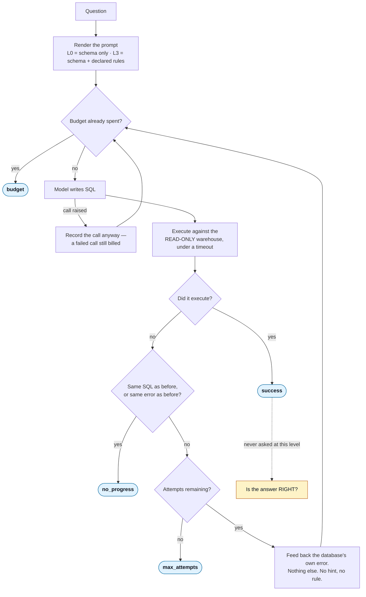

# Stage 01 — The Agent Loop (Level 1)

> Folder numbers are **loop levels and session stage order**, not phase numbers.
> New to the vocabulary? Read [`demos/README.md`](../README.md) first — it defines
> *silent error*, *gold item*, *L0/L3*, *termination reason* and everything else used
> below.

---

## What this level ADDS

A model writes SQL, the query runs against a read-only warehouse, and when it fails the
database's own error goes back to the model, which tries again. That is the whole of
Level 1: **retry on failure**.

**Be precise about which failure, because it is the teaching point.**

> **Level 1 catches SYNTACTIC failure. It cannot catch SEMANTIC failure.**
>
> It retries when the SQL did not parse, did not run, or timed out. The feedback it
> receives is the database error and nothing else — not a hint, not a rule reminder,
> just the database's own complaint.
>
> It cannot catch SQL that parses, runs, returns a clean number, and is **wrong**.
> Nothing at this level compares the answer to anything, because there is nothing to
> compare against that the agent is allowed to see.

The distance between those two is the entire reason Level 2 exists, and this stage is
where a room should *feel* it before it is named.

### The control flow



**The four termination conditions are recorded by name on every run**: `success`,
`max_attempts`, `budget`, `no_progress`. Their distribution across a full run is
reported, because a policy branch nobody counts is a branch nobody knows fires. At this
stage's default of one attempt per question, `budget` and `no_progress` are structurally
unable to fire — Stage 02 raises the cap and is where they first become reachable.

The amber box is the point of the stage. Nothing in that diagram asks it.

### The trap

`trap.py` runs every gold question twice: **the same model with the rules written down
(L3) and with them withheld (L0)**. Same model, same questions; the only variable is the
spec.

Running two *different* models instead would teach "buy the bigger one", which is the
opposite of this workshop's argument and would have to be argued against later. And L0
on its own is a wall of red that teaches nothing, because nobody can tell how much of it
is the missing spec and how much is the task simply being hard — **the L3 column is what
makes the L0 column legible.** Both columns are labelled on screen.

The questions are phrased the way a business user asks them, so the rules are never
smuggled into the question at either level. A test bans the rule vocabulary from
question text.

**Scoring is separated from execution, and that separation is the demo.** Each cell is
judged the moment its result lands and the judgement is held unrevealed. Pressing
*reveal* flips a flag; it re-runs nothing. A test asserts reveal makes zero model calls.

---

## What this level COSTS

One model call per attempt per question, on the cheaper worker model.

`trap.py` runs the whole gold set twice — once per spec level — so it is the largest
call count in this stage, though not the largest bill.

Every call is metered, including failed, timed-out and budget-exhausted ones, because
those generate tokens and bill. **Token counts are measured; the dollar figure is
estimated** — measured tokens times a hand-entered price table — and renders with the
`est.` prefix, which never comes off. Only a billing export would make cost a
measurement, and this project does not read one.

`trap.py` projects its cost before the first call and refuses to start if the projection
breaches `--cap-usd`. Stop it at any time; partial results are already written to
`results/`.

---

## Run it COLD

No prior step is required. Every command works from a clean checkout with the venv
installed; the warehouse is generated on first use and nothing needs seeding by hand.

### 1. One question, live

```bash
uv run python demos/01_agent_loop/run.py \
  --question "What was gross revenue in March 2025 from our euro and yen orders, in US dollars?"
```

**What appears:** the termination reason and model id, then one block per attempt — the
SQL the model wrote, and either the rows it returned or the database error it hit. Then
a cost line: estimated dollars, call count, and tokens split by class.

**What to observe:** most questions land on the first attempt. When one does not, the
error line is the *only* thing fed back. Notice how little the loop is told.

**The question to sit with:** *the last attempt returned a number. What in this output
tells you whether that number is right?*

### 2. The same thing in a browser

```bash
uv run python -u demos/01_agent_loop/run.py
```

Omit `--question` and it serves the AGENT view instead of running headless. Use `-u`:
without it Python block-buffers stdout when you redirect to a file and the URL never
appears even though the server is fine.

### 3. The trap

```bash
# in a browser, which is how it is delivered
uv run python -u demos/01_agent_loop/trap.py

# or in the terminal
uv run python demos/01_agent_loop/trap.py --headless

# fewer items while developing
uv run python demos/01_agent_loop/trap.py --headless --limit 6
```

**What appears:** a grid, one row per gold item, one column per arm. Cells fill in as
results land. **Every landed cell renders identically** — a cell reading "failed" before
the reveal would hand the room a free answer key for that row.

**What to observe while it fills:** the columns look the same. That is deliberate and
worth saying out loud.

**Then press reveal.** The withheld-rules column is visibly worse, and the scoring
splits three ways: correct, **silently wrong**, and visible failure.

**The question to sit with:** *of the cells that are wrong, how many could you have
spotted without the answer key?*

---

## Expected SHAPE — and what to say if it does not appear

**`run.py`** — a timeline of attempts, with cost ticking upward. Some questions show a
crash, an error line, and a retry that succeeds.

**`trap.py`** — two columns that look alike while running, then a reveal in which the
withheld-rules column is worse. The shape to watch for is **high apparent success next
to low actual correctness**, in both columns.

The comparison is **paired**: both columns answered the same questions, so the reveal
reports McNemar's exact test over the discordant pairs — the items where one arm was
right and the other wrong. Items both arms got right, or both got wrong, carry no
information about which is better. The wording is directional on purpose — *"worse; we
cannot put a number on how much"* — because the items come in clusters and any specific
gap would be more precise than the design supports.

### If the shape does not appear

*If the two columns come out close*, say so plainly and move to Level 2. The point does
not depend on the size of the gap; it depends on there being a category of failure the
loop cannot see. A small gap on the day is a fact about the model, not a broken demo.
**Do not re-run hoping for a better number** — that is the exact behaviour this session
argues against.

*If a question errors on every attempt*, that is a **visible** failure, which is the
benign kind. Say that out loud; it is the contrast that makes the silent kind land.

*If the reveal seems slow*, it is not re-running anything — every judgement was computed
as its cell landed. If it genuinely hangs, the browser lost the `gr.State`; re-run the
trap rather than reloading the page.

*If the grid never fills*, check the API key resolves (`uv run python -c "from
loopeng.settings import load_settings; load_settings()"`). A missing key raises an error
naming the exact variable and the exact fix.

---

## Where the code lives

| you are looking for | it is in |
|---|---|
| the loop and its four termination conditions | `src/loopeng/agent/loop.py` |
| visible vs silent classification, the error taxonomy | `src/loopeng/agent/classify.py` |
| the trap runner, arms, cost projection | `src/loopeng/agent/trap.py` |
| the grid and the reveal | `src/loopeng/views/trap.py` |
| the read-only connection and the query timeout | `src/loopeng/warehouse/connect.py` |
| the gold set and its wrong-answer variants | `src/loopeng/gold/` |
