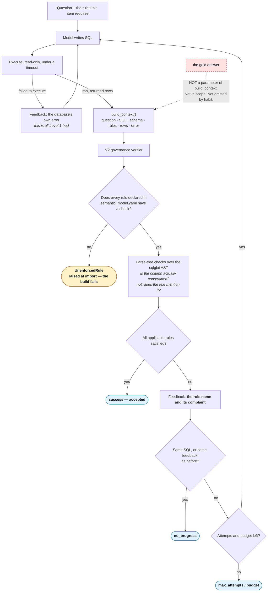

# Stage 02 — The Verification Loop (Level 2)

> Folder numbers are **loop levels and session stage order**, not phase numbers.
> New to the vocabulary? Read [`demos/README.md`](../README.md) first.

---

## What this level ADDS

Verifiers. Level 1 could only see a query that crashed. Level 2 checks a query that
**ran** against the business rules it was supposed to honour, and sends it back with the
specific complaint.

A verifier here is a function that receives the question, the SQL, the schema, the rules
this item requires, and what happened when the query ran — and returns the rules it
believes were broken.

**It never receives the gold answer, and that is structural rather than conventional.**
`VerifyContext` has no field for it, and `build_context()` takes no gold parameter, so
there is nothing in scope at the construction site for a careless author to pass
through. A verifier that could see the answer would score perfectly and measure nothing.

### The control flow



Two things in that diagram are the stage.

**The feedback path carries a rule name and never the answer.** The model is told
*"[multi_currency] Amounts in different currencies are being combined without
conversion"* — never the number it should have produced, never how far off it was.

**The governance verifier reads its rule set from the config.** V1 was a dictionary of
Python checks, and it had the defect this whole workshop is about: the rule set it
enforced and the rule set the config declared were two separate lists nobody compared.
Add a rule to the YAML and V1 silently did not enforce it — the prompt told the model
about it, the semantic model documented it, and nothing checked it. V2 makes the config
the source of truth and **fails the build** when a declared rule has no check. It caught
a real gap on its first run.

### Checks read the parse tree, not the text

`check_soft_delete` asks *"is `deleted_at` actually constrained anywhere in this query's
logic?"* by walking the sqlglot AST. A check that greps for `deleted_at IS NULL` passes a
query with that string inside a comment, inside a subquery that never joins, or negated.

`regex_swap.py` exists to demonstrate exactly that.

### The beat that matters most: a satisfied verifier and zero correct answers

Run the swap at **L0** and both verifiers report everything accepted while almost nothing
is right.

That is not a bug. It is the honest ceiling of a *structural* verifier. The currency
check confirms the query **converts** — that a `CASE` over `currency` exists — and it
cannot confirm the **rates inside it are right**, because nothing about summing mixed
currencies is structurally detectable without the FX factors. At L0 the model has never
seen those factors, so it writes a well-shaped conversion using invented numbers, and
every check passes.

Say this out loud. A verifier that is fully satisfied while every answer is wrong is a
sharper lesson than the regex swap, and it is the one people recognise from their own
systems.

**The implication is a prediction, not a conclusion:** whatever the loop buys at L0 has
to come from governance and execution feedback rather than from structural checks. Stage
04's ablation is what tests that. Do not present it as established.

### The uncomfortable half: swapping the instrument

`regex_swap.py` replaces the AST rule checks with regexes looking for the same thing in
text. The result: the **acceptance rate goes up**, rejections go **down**, cost goes
**down** — and the verifier demonstrably **catches less**.

Three of those four look like an improvement on a dashboard.

Say **"catches less"**, not "quality goes down". Whether the *answers* got worse is a
separate claim, it is underpowered at this `n`, and it is bounded by construction: the
two arms can only differ on items the strict verifier actually rejected. The demo prints
that bound. The demonstrated fact is that **a weaker instrument reports better numbers**,
which is enough.

The only way to tell an improvement from a weakened instrument is to test the instrument
against inputs whose correctness you already know — the **rule-surface probes**. Two per
rule: one query that breaks it and must be rejected, and one that is *correct but
unusual* and must be accepted. The second is the one people skip, and without it a
verifier that rejects everything scores perfectly.

### Abstention: the loop can decline, and say why

`abstain.py` turns coverage from a synonym for *did not crash* into a **choice**.

The confidence signal is read off the loop's own telemetry — did the query run, how many
times did the verifier send it back, which branch terminated the run — rather than from
an extra call asking the model whether it is sure. That is cheaper, and it is more
honest: a model's stated confidence is one more generation to be wrong about, while a
`no_progress` termination is a fact about what happened.

Because the signal is telemetry, the whole coverage/precision curve can be recomputed
over runs that were already measured. **Calibrating abstention costs nothing.**

A declined question shows its reason in plain English and the operator can open the
attempts behind it. **The gold answer is deliberately not shown in that view** — someone
judging whether a decline was fair should be looking at the query and the reason, not at
the answer key.

Answer submission is deliberately missing. It was scoped as polish, and a half-built
write path that silently drops an operator's answer is worse than an obvious gap.

---

## What this level COSTS

More than Level 1 per question: each verification round is another call, and a rejected
attempt means the generation runs again. That is the trade being shown — **Level 2 buys
correctness with tokens**, and the run's own meter is the honest way to see how much.

`regex_swap.py` runs the same questions twice, once per verifier, so it costs roughly
double a single pass.

`failure_paths.py` makes real model calls on purpose. None of the three scenarios stubs
the model, because what is being demonstrated is the controller's behaviour under a real
generator, and a scripted client would only prove that the scripted client works.

As everywhere: tokens measured, dollars estimated with the `est.` prefix, every call
counted including the ones that failed.

---

## Run it COLD

No prior step required. Does not depend on stage 01 having run.

### 1. One question through the verifiers

```bash
uv run python demos/02_verification_loop/run.py

# or pick the item yourself
uv run python demos/02_verification_loop/run.py --item p05_net_revenue__02

# or watch what happens with the rules withheld
uv run python demos/02_verification_loop/run.py --level L0
```

**What appears:** the question, the rules it requires, then one block per attempt — the
SQL, and either `VERIFIER REJECTED` with the named rule and complaint, or `accepted`
with the rows.

**What to observe:** the **diff between attempts**. A filter appearing. A `CASE` over
currency being added. Point at the change, not at the final answer.

**The question to sit with:** *the rejected query ran cleanly and returned rows. What
told us it was wrong, and could that same thing have told us at Level 1?*

### 2. The swap

```bash
uv run python demos/02_verification_loop/regex_swap.py

# the L0 beat — a fully satisfied verifier and almost nothing right
uv run python demos/02_verification_loop/regex_swap.py --level L0
```

Defaults to items requiring `fan_out`, because that is where the two verifiers genuinely
differ: *"`orders.amount_minor` aggregated **after** joining `order_items`"* is a shape,
not a word, and text cannot express it.

**What appears:** two arms side by side — acceptance rate, actual correctness, rejection
count, cost, and probe surface — then a generated reading.

**What to observe:** the probe surface dropping while the acceptance rate rises.

**The question to sit with:** *which of these four numbers would have appeared on a
dashboard, and which one would have told you the instrument got worse?*

### 3. The termination branches

```bash
uv run python demos/02_verification_loop/failure_paths.py
```

Three runs that end **without** succeeding: the attempt cap, the budget cap, and the
no-progress detector. Not every demo path is a success path, and a branch nobody has
watched fire is a branch nobody has tested. Exits non-zero if any branch fails to reach
the termination it claims.

### 4. Abstention

```bash
# print the curve and the declined list
uv run python demos/02_verification_loop/abstain.py --headless

# serve the intervention view
uv run python -u demos/02_verification_loop/abstain.py
```

Needs a measured cell on disk — run stage 04's sweep first, or pass `--dir` at a
directory that has one. It says so plainly if there is nothing to read.

**What to observe:** move the threshold and watch coverage and precision move in
**opposite** directions.

**The question to sit with:** *a single accuracy number would have hidden this trade
completely. Where on that curve would you actually want to sit?*

---

## Expected SHAPE — and what to say if it does not appear

**`run.py`** — at least one rejection with a named rule, then a revised query that
differs in a visible way.

**`regex_swap.py`** — the regex verifier scores **higher** while catching **less**: a
higher acceptance rate, fewer rejections, lower cost, and a probe surface that drops
from fully sound to at least one missed violation.

**The correctness comparison is underpowered and the demo says so.** At this `n` the
interval is wide enough that "quality held" and "quality halved" cannot be told apart,
and the arms can only differ on items the strict verifier actually rejected — the demo
prints that bound. **Do not read equal correctness as evidence the weaker verifier is
fine. Read the probe surface.**

**`failure_paths.py`** — three runs, each reaching the branch it names.

**`abstain.py`** — a slider, with coverage and precision trading against each other, and
a list of declined questions each explaining itself in a sentence.

### If the shape does not appear

*If the regex verifier does not score higher*, do not treat it as a failed demo. The
narration is generated from what actually happened and refuses to claim a dashboard
effect that did not appear. Say what happened and make the point directly: the risk is
that a verifier is graded by the score it produces rather than by what it catches, and
the fix is to check instruments against known-wrong inputs. **The argument stands whether
or not the numbers cooperate on the day.**

*If a verifier rejects everything*, that is also worth showing: an instrument that never
passes anything is as useless as one that never fails anything, and it is **visibly**
broken rather than silently wrong.

*If nothing is declined* in `abstain.py`, the threshold is too low — raise it until
something is, and say that out loud. An abstention mechanism that never abstains is
decoration.

*If `failure_paths.py` reports a MISMATCH*, read which branch. `max_attempts` reporting
`no_progress` means the over-strict verifier is repeating its complaint — that is the
no-progress detector working, and the scenario needs varied feedback to reach the cap.
That distinction was found by running it, not by reading it.

*If the build raises `UnenforcedRule`*, someone added a rule to `semantic_model.yaml`
without a check in `RULE_CHECKS`. That is the governance gate doing its job. It is also
the single best live demonstration available in this stage, if you have the nerve.

---

## Where the code lives

| you are looking for | it is in |
|---|---|
| the Level 2 loop, `build_context` and its missing gold parameter | `src/loopeng/verify/loop.py` |
| the AST rule checks | `src/loopeng/verify/verifiers.py` |
| the governance verifier and the build gate | `src/loopeng/verify/governance.py` |
| the deliberately weaker regex checks | `src/loopeng/verify/regex_verifiers.py` |
| the swap comparison and its generated reading | `src/loopeng/verify/swap.py` |
| the rule-surface probes | `src/loopeng/verify/probes.py` |
| the three termination scenarios | `src/loopeng/verify/failure_paths.py` |
| the contract type with no field for the answer | `src/loopeng/contracts.py` |
| abstention scoring and the intervention view | `src/loopeng/triage/abstain.py`, `src/loopeng/triage/ui.py` |
