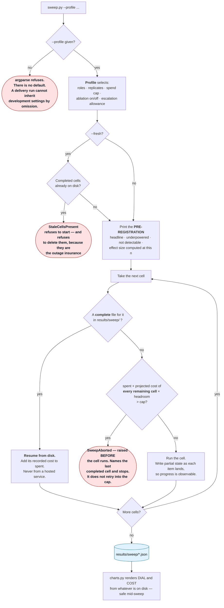

# Stage 04 — The Hill-Climbing Loop (Level 4)

> Folder numbers are **loop levels and session stage order**, not phase numbers.
> New to the vocabulary? Read [`demos/README.md`](../README.md) first.

---

## What this level ADDS

The loop around the loop.

Levels 1–3 answer a question. Level 4 asks which **configuration** answers questions
better, and measures it — a sweep across model and prompt completeness, every cell run
under the same harness.

A **cell** is one combination: a role (`worker` or `frontier`), a prompt level (`L0` or
`L3`), a mode (`one_shot` or `loop`), and a replicate index. Each cell runs the whole gold
set and reports a silent-error rate with its interval.

This is where the session's discipline stops being implicit and becomes the subject.

### Three things are stated on screen before the first cell runs

- **the headline** the sweep exists to test
- **what it is underpowered for**, named rather than discovered afterwards
- **what it already knows it cannot detect**, with the measurement that says so

A hypothesis stated after the numbers are in is not a hypothesis. The pre-registration is
printed by the runner itself, so it cannot be quietly skipped on the day. It includes the
**detectable effect size at this `n`, computed rather than asserted**, and the note that
clustering makes the true figure worse.

### The control flow



Three properties in that diagram matter more than any number the sweep produces.

**It resumes from `results/`, not from a hosted service.** A probe measured that LangSmith
re-runs everything on restart rather than skipping completed work, so a finished cell is a
file on disk and nothing else is consulted. A dropped venue connection costs the cell in
flight, never the cells behind it.

**It aborts on projected spend, not on actual.** Checking actual spend against a cap only
discovers the breach after it happened. Before every cell the runner adds what it has
already spent to what every remaining cell is projected to cost, and refuses to start if
that total exceeds the cap.

**`--fresh` refuses rather than deletes.** Two correct requirements collide here: cell
files must be *present* on the venue machine, because they are what keeps stages 0, the
Phase 2 probes and stage 4 alive through an API outage — and they must be *absent* when
the live sweep starts, or it resumes and completes instantly, rendering finished numbers
to a room just told nothing is precomputed. A checklist line is not enforcement, so the
live command carries `--fresh` and the code refuses. Silently deleting the outage
insurance to satisfy a flag would trade one failure for a worse one, and only the operator
knows whether those files are still needed.

### Incomplete cells are never blank, never zero, never a guess

A cell still running reports *"in progress, n=NN so far"* with the interval over what has
landed, and draws as a hollow bar. **A zero on a chart reads as a measurement.**

### Two charts ship, not three

**DIAL** (silent-error rate per cell) and **COST** (estimated spend per cell). A third
chart plotting a finding that did not reproduce would be the same defect as reporting an
unmeasured number.

### One asymmetry must be said out loud every time a cross-model comparison appears

The worker model is pinned to a fixed temperature. The frontier model **rejects that
parameter with a 400** and cannot be pinned. So the two models' error bars do not carry
the same thing — one is sampling noise, the other is sampling noise **plus** run-to-run
variance. **Within a model they are comparable. Across models they are not.** The DIAL
caption says so permanently rather than relying on anyone remembering, and the reference
badge on each row says which side was measured live.

---

## What this level COSTS

The most expensive stage, and the only one that runs unattended long enough to matter.
Every cell runs the whole gold set, and replicated cells run it several times.

The frontier model dominates the bill, and dominates it most where the rules are withheld,
because thinking runs longer when the task is harder.

Two budgets, tracked separately: the **grid** budget is what one delivery costs, paid fresh
each time; **development** spend is what building it cost once.

`--profile` is required and has no default. `delivery` is the cheap profile that runs in
front of a room; `development` runs both models with replicates and the ablation and was
run once to establish the findings; `exhibit` runs nothing at all and exists so the public
Space cannot spend.

---

## Run it COLD

No prior stage is required. The sweep builds whatever it needs.

### 1. Start the sweep — live, at the top of the stage

```bash
uv run python demos/04_hill_climbing_loop/sweep.py --profile delivery --fresh
```

**`--detach` is the default and that is deliberate.** A sweep that holds the terminal
cannot be started while you keep talking, which is the entire reason it exists. It prints
a pid, a `tail -f` command, and hands the terminal straight back.

**PRESS IT LIVE, AT THE TOP OF THIS STAGE.** The delivery sweep finishes fast enough to
watch — likely before you have finished introducing what it does. That is better than
starting it earlier and returning to a finished chart: the room sees it go from empty to
full, and a chart that fills while you talk is much harder to disbelieve than one that was
already there.

**The wait is what the pre-registration is for.** Read it aloud while the cells land:

1. the **headline comparison** — what this sweep exists to test
2. the **detectable effect size at this `n`**, computed rather than asserted, and the note
   that clustering makes the true figure worse
3. **what we said in advance we could not resolve**, with the measurement that says so

That is the strongest possible use of the gap. The room hears the claim registered
*before* the data lands, which is the difference between a prediction and a description —
the same discipline the whole session argues for, performed rather than described.

If you finish reading before the sweep finishes, talk about the cost cap and the fact that
it aborts on *projected* rather than actual spend.

### 2. Watch it, if you want to

```bash
tail -f results/sweep_run.log

# or run in the foreground instead of detaching
uv run python demos/04_hill_climbing_loop/sweep.py --profile delivery --foreground
```

### 3. Render the charts

```bash
uv run python demos/04_hill_climbing_loop/charts.py

# include the stored frontier cells, drawn hatched and dated
uv run python demos/04_hill_climbing_loop/charts.py --with-reference
```

**Safe to run repeatedly, mid-sweep.** It renders from whatever exists so far.

**What appears:** `results/charts/dial.svg` and `cost.svg`, plus a line per cell showing
its current rate.

**What to observe:** run it twice, a minute apart. The intervals narrow as more items land.
**That narrowing is the session's argument about measurement happening live** rather than
being asserted.

### 4. The views

```bash
uv run python -u demos/views.py --view dial
uv run python -u demos/views.py --view oversight
```

DIAL carries the live/reference badges on every row. OVERSIGHT carries abstention,
escalation and the triage panel, each with the caveat that travels with it.

**The question to sit with:** *the pre-registration named an effect size this design can
detect. Is the gap you are looking at bigger than that?*

---

## Expected SHAPE — and what to say if it does not appear

**The DIAL:** separation between cells, with the more complete prompt doing better than the
less complete one, and intervals that visibly narrow as more items land.

**The COST chart:** the cheap model's cells small, the frontier model's large, and the
withheld-rules cells larger than the rules-given ones on the frontier model. The shape is
*where the money goes*, not how much.

**The decision rule to state once the bars are up** — phrased as guidance, because the
numbers do not exist until the room is in front of you:

> Where the withheld-rules bars sit far apart between one-shot and loop, say the loop is
> doing the work. Where the rules-given bars sit close together, say **we cannot tell them
> apart at this `n`** — not that they are equal. The frontier model may still be
> numerically ahead there, and "cannot tell" is the honest word for it.
>
> The rule the room can take away: **the cheap model with a loop is never measurably
> worse, and is measurably better when the spec is incomplete.** That is what makes "use
> the big model *here*" a policy rather than "use the big model" being a purchase.

### If the shape does not appear

*If the cells overlap within their intervals*, that is a real result and reads as one: at
this `n` the difference is not resolvable, and the honest sentence is *"we cannot tell
these apart yet"* — not a claim about a winner. **Overlapping intervals reported honestly
is a better outcome for this session than a clean separation reported carelessly.** The
pre-registration already named the effect size the sweep can detect, so this is a
possibility the room was warned about rather than a surprise.

*If a cell is missing*, it has not finished or the cap stopped the sweep. It renders as
*not yet measured*. Say which — **a blank that the room reads as zero is exactly the
failure this whole apparatus exists to prevent.**

*If the sweep aborts*, the cap did its job **before** spending, not after. Show the
message: it names what was spent, what remained, and the last completed cell. **Do not
retry into the cap.**

*If the sweep refuses to start*, `--fresh` found completed cells on disk. It is telling
you they are still there. Decide whether you still want them for outage cover; if not,
remove them yourself and re-run. **Do not drop `--fresh` to get past it.**

*If the sweep finishes instantly and the chart is already full*, you ran without `--fresh`
and it resumed from disk. That is correct behaviour and exactly what you do not want in
front of a room told nothing was precomputed.

*If it is much slower than in development*, it is almost always the venue network. Say so.
The pre-registration is what the wait is for.

*If someone compares a worker bar to a frontier bar by eye*, **stop them.** That is the
asymmetry in the caption, and it is the easiest mistake in the room to make.

*If a rate limit appears mid-sweep*, lower the per-model concurrency in
`src/loopeng/sweep/runner.py` **before** re-running rather than after it starts failing,
and say out loud that it will take longer.

---

## Where the code lives

| you are looking for | it is in |
|---|---|
| profiles, cells, the projected-spend abort, `--fresh` | `src/loopeng/sweep/runner.py` |
| the pre-registration and the resume loop | `src/loopeng/sweep/orchestrator.py` |
| the DIAL and COST SVGs and their permanent captions | `src/loopeng/sweep/charts.py` |
| the frozen reference cells and the noise floors | `src/loopeng/sweep/reference.py` |
| the DIAL view and its live/reference badges | `src/loopeng/views/dial.py` |
| abstention, escalation, triage | `src/loopeng/triage/` |

> **For whoever edits the rendering code:** numeric literals are banned in the eight
> modules that render to a room, enforced by `tools/lint_no_numbers.py`. Every number the
> room sees comes from a `Metric` carrying its own `n`. Genuine layout geometry is exempt
> by a trailing `# layout` marker on the line, and the rule prints how many exemptions
> exist so the count cannot grow quietly. A typed number is indistinguishable from a
> measured one once it is on a projector.
