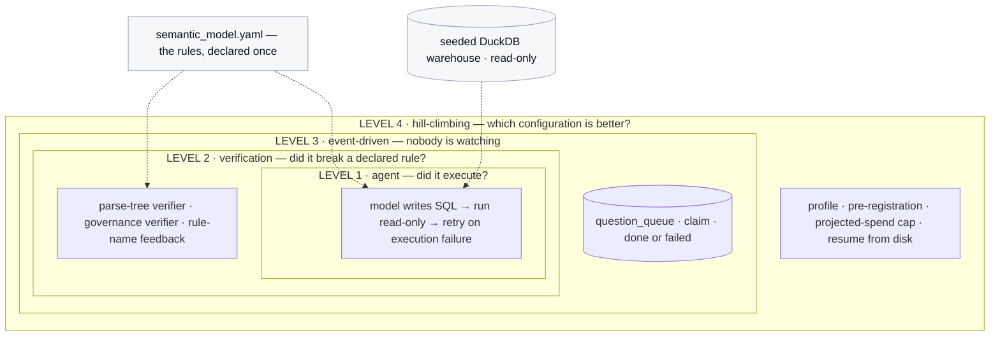

# Demos — one folder per loop level

This folder is the documentation. There is no `docs/` directory and no separate
runbook: **each stage README is the runbook for that stage**, kept beside the code it
describes, because a runbook stored apart from its code drifts, and a runbook that lies
to you at minute forty of a live session is the one thing this project cannot afford.

**Start here if the term "loop engineering" is new.** The vocabulary section below
defines everything the stage READMEs assume.

---

## Vocabulary — read this first

These terms are used precisely throughout, and several of them mean something narrower
here than in ordinary use.

| term | what it means in this project |
|---|---|
| **loop** | A controller that repeats an attempt and decides when to stop. Not a `for` statement — the interesting part is always the *termination condition*, never the repetition. |
| **loop level** | Which class of failure a loop can see. Level 1 sees crashes. Level 2 sees rule violations. Level 3 removes the human. Level 4 compares configurations. Each level wraps the one below it. |
| **declared rule** | A business rule written down in `src/loopeng/warehouse/semantic_model.yaml`. Declaring costs nothing and proves nothing. |
| **enforced rule** | A declared rule that some code actually checks. The gap between declared and enforced is the entire subject of this workshop. |
| **visible failure** | The query did not run, returned nothing, returned NULLs, or returned the wrong *shape*. You can tell it is wrong **without knowing the right answer**. |
| **silent error** | The query ran, returned a clean plausible number, and is wrong. You **cannot** tell without the answer key. This is the failure class everything here is built around. |
| **silent-error rate** | Silent errors divided by answers that ran and returned something. Visible failures are deliberately excluded from the denominator — folding them in inflates the headline with failures the room can already see. |
| **gold item** | One question, its correct SQL, its correct answer, and the wrong answers you get by ignoring each rule. Written SQL-first: the query comes first and the question is derived from what it returned. |
| **naive answer** | What you get ignoring every rule at once. If an item's gold answer equals its naive answer, that item cannot tell a good configuration from a bad one and the build refuses it. |
| **L0 / L3** | Prompt completeness. **L0** gives the model the schema only. **L3** gives it the schema *plus* every declared business rule. The gap between them is the whole experiment. |
| **worker / frontier** | Model roles. `worker` is the cheap model, pinned to a fixed temperature. `frontier` is the expensive one, which rejects that parameter and cannot be pinned. |
| **verifier** | A function that reads a query and returns the rules it broke. It never receives the gold answer — not by convention, but because the context type has no field for it and the function that builds one takes no such argument. |
| **rule-surface probe** | A pair of queries per rule: one that breaks it and must be rejected, one that is *correct but unusual* and must be accepted. This is how you test a measuring instrument — against inputs whose answer you already know, not by admiring the numbers it produces. |
| **termination reason** | Why a loop stopped, recorded by name. A policy branch nobody counts is a branch nobody knows fires. |
| **abstention** | The loop declining to answer. Turns "coverage" from a synonym for *did not crash* into a **choice** the operator makes. |
| **reference measurement** | A stored figure from an earlier dated run, drawn hatched and labelled with its date so it can never pass for something computed just now. |
| **Metric** | The only way a number enters this project. It carries its own `n` and its own interval, computed from counts rather than passed in, so nobody can assert a precision they did not observe. |

---

## The four levels, and why they nest

**Folder numbers are loop levels and session stage order. They are not phase numbers.**

That trips people, so it is worth being blunt: the build was organised by *phase*
(Phase 0 foundation, Phase 2 verifiers, Phase 3 sweep) and this folder is organised by
the order a room sees things. They do not line up and are not meant to.

| folder | loop level | what it adds | the failure it can finally see |
|---|---|---|---|
| [`01_agent_loop/`](01_agent_loop/) | Level 1 | Retry on execution failure | SQL that crashes |
| [`02_verification_loop/`](02_verification_loop/) | Level 2 | Rule checks over the parse tree | SQL that runs and breaks a declared rule |
| [`03_event_driven_loop/`](03_event_driven_loop/) | Level 3 | A queue and a worker, no human | — (it removes the human, it adds no new check) |
| [`04_hill_climbing_loop/`](04_hill_climbing_loop/) | Level 4 | A pre-registered sweep | Which configuration is actually better |

The loops **wrap one another rather than sitting side by side**. Level 2 calls Level 1's
generator and adds a verifier around it; Level 3 runs the Level 2 loop against a claimed
row; Level 4 sweeps Levels 1 and 2 across models and prompt completeness.



That nesting is why **the implementation lives in `src/loopeng/` and these folders are
thin entry points**. Four folders each owning a copy of the loop would be four places
for it to drift, and every number a room sees has to come out of one system or the
comparisons between levels mean nothing.

---

## Rule 1 — demos are thin entry points

**No loop logic lives here.**

| package | holds | called by |
|---|---|---|
| `loopeng.agent` | the Level 1 loop, classification, the trap | `01_agent_loop/` |
| `loopeng.verify` | verifiers, governance, rule-surface probes, the swap | `02_verification_loop/` |
| `loopeng.queue` | the question queue and its polling worker | `03_event_driven_loop/` |
| `loopeng.sweep` | the sweep runner, profiles, charts, reference cells | `04_hill_climbing_loop/` |
| `loopeng.triage` | abstention, escalation, failure triage | `02_`, `04_` |
| `loopeng.views` | the five Gradio views | `views.py` |
| `loopeng.warehouse` | the seeded generator, semantic model, read-only connection | everything |
| `loopeng.gold` | patterns, the build that freezes answers, comparison | everything |

A demo file wires arguments, calls into `src/`, and renders. That is all. A demo over
~100 lines means logic has leaked, and `tests/test_demo_structure.py` fails the build
rather than leaving it to be noticed later.

## Rule 2 — every demo cold-starts

**No demo may depend on another having run in the same session.** This is an opt-in
floater format: people arrive mid-session, and the stage that runs is whichever one the
room has arrived for.

Every entry point generates or loads what it needs — the warehouse is created on first
use, the gold set is rebuilt from the patterns, the queue table is created on connect.
A test runs each entry point from a clean working directory, so "it worked when I ran
them in order" cannot pass for working.

## Rule 3 — no numbers in these READMEs

Results do not exist until the room is in front of you. Anything quoted in advance is a
number somebody will read off a page as though it had been measured. Numbers live in
the app, stamped `computed HH:MM today · n=NN` by the thing that computed them, and in
the README's generated images, which carry their own measurement date inside the image.

## A note for the Gradio views

The views import from `loopeng.views`, and `demos/views.py` serves any of them. Keep
per-user state in `gr.State` — **never at module scope, never in `os.environ`.**
Module-level state works perfectly when one person is clicking and leaks across sessions
the moment two browsers are open, which is exactly the configuration in front of a room.

```bash
uv run python -u demos/views.py --view {agent,trap,verify,dial,oversight,exhibit}
```

The event-driven loop is deliberately **not** a view: the point of that stage is that
nobody is watching, and a browser tab implies a person supervising it.
